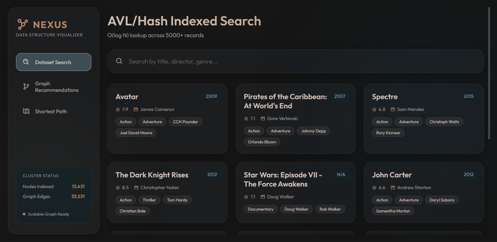
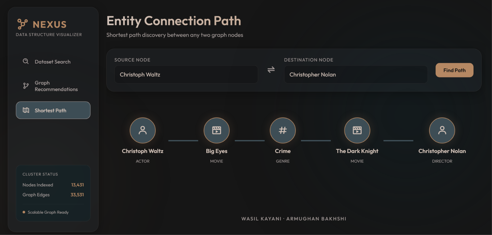

# Movies Data Manager & Graph Visualizer (NEXUS)

An enterprise-grade, high-performance Movies Data Manager and Graph Visualization platform built to showcase core Data Structures (AVL Trees, Hash Tables, Graphs) coupled with a modern interactive Python Flask interface.

---

## 📸 Interface Preview

### Dashboard & Indexed Search

*Real-time indexed search simulation showcasing O(log N) tree lookups and distributed cluster statistics.*

### Graph Traversal & Shortest Path Discovery

*Interactive BFS/DFS traversal scoring and shortest connection paths between entities in the movie network.*

---

## 🏗️ Architecture Overview

The system consists of two synergistic layers:

1. **High-Performance C++ Core Engine**:
   - **AVL Tree (`AVL.cpp` / `avl.h`)**: Self-balancing BST guaranteeing $O(\log N)$ search, insertion, and deletion across movie titles.
   - **Custom Hash Table (`HashTable.cpp` / `HashTable.h`)**: Collision resolution with chaining for $O(1)$ amortized lookups on actors and directors.
   - **Undirected Graph Network (`Graphs.cpp` / `graphs.h`)**: Multi-relational graph linking Movies, Actors, Directors, and Genres with BFS/DFS exploration algorithms.
   - **Zero-STL Architecture**: Engineered from scratch without the C++ Standard Template Library.

2. **Web Visualization & Analytics Layer (`flask_app/`)**:
   - **Real-Time Autocomplete & Search Engine**: Live case-insensitive matching across titles, cast, and crew.
   - **Multi-Hop Traversal Engine**: Recommendation algorithms based on graph distance and neighbor scoring.
   - **Dijkstra / Shortest Path Visualizer**: Uncovers degrees of separation between any two nodes in the network.
   - **Glassmorphic UI**: Sleek, custom-tailored dark palette with dynamic node-edge simulations.

---

## 🎬 Quick Start Guide

### 1. Running the Web Visualization (Flask)

```bash
# Navigate to the flask app directory
cd flask_app

# Install dependencies
pip install -r requirements.txt   # or: pip install flask

# Start the local server
python app.py
```
Open your browser and navigate to: **`http://127.0.0.1:5000`**

### 2. Compiling the C++ Core Engine

```bash
# Compile with any modern C++ compiler (e.g. g++)
g++ -std=c++17 main.cpp AVL.cpp Graphs.cpp HashTable.cpp structures.cpp -o movies_manager

# Execute
./movies_manager
```

---

## 👥 Authors
- **Wasil Kayani**
- **Armughan Bakhshi**
